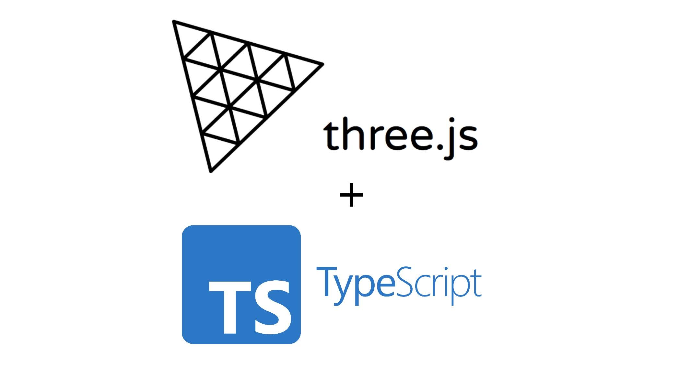

# three.js + TypeScript boilerplate

Hi there :wave:!

This is a simple but yet simple starter kit for your three.js project. Use it as a boilerplate or simply as a quick sandbox, that's up to you :slightly_smiling_face:.

## Features
- Webpack 4
- ESLint
- TypeScript
- Webpack Bundle Analyzer

## Usage
### Run the project in development mode

```
yarn start
```

### Build the project

```
yarn build
```

This will create a `build/` folder with an index.html file, all the JS and CSS minified and the JS sourcemap.


### Run ESLint only

```
yarn run lint
```


### Build the project and show report using Webpack Bundle Analyzer

```
yarn run report
```
